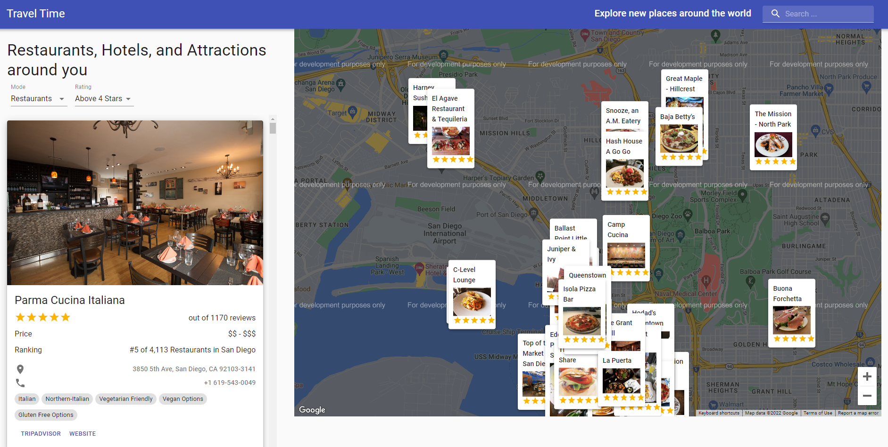
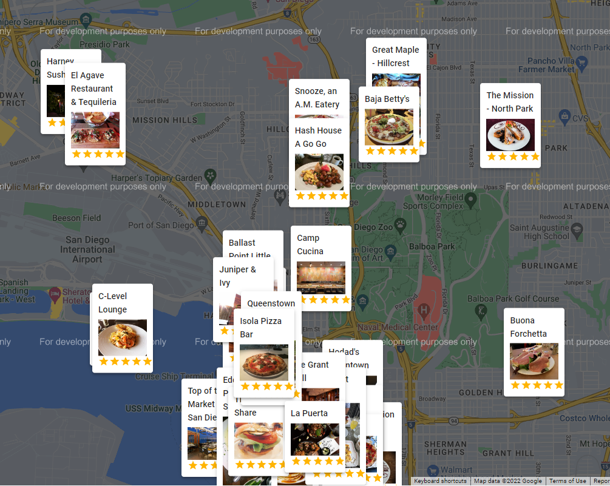

# Travel Guide Application Using Google Maps API

This website allows users to use geolocation through the popular Google Maps API to find restaurants, hotels, and attractions near them. From the moment you enter the website, it will use your location through your cookies to find whatever travel accomadations you need. The user can filter the travel options according to their rating and type. Each display card for nearby businesses include their rating, number of reviews, price, ranking, awards, a link to their website, and a link to the travel advisor website.

This website was created through the specific usage of Javascript and React. To run this application, simply type the following command into the terminal: "npm start".

As a side note, the search functionality is present, but to make it work with the google maps API you have to put in your billing information to use their search function.

# References
Adrian Hajdin (https://www.youtube.com/c/JavaScriptMastery)
